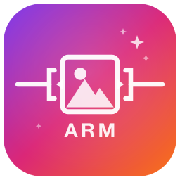

<p align="center">
  
</p>

<h1 align="center">ImageArm</h1>

<p align="center">
  <strong>Optimisation d'images surpuissante pour macOS.</strong><br>
  GPU Metal. Multi-outils. Zero dépendance.
</p>

<p align="center">
  
  
  
  
  <a href="https://ko-fi.com/imagearm"></a>
</p>

<p align="center">
  <a href="#-english">English</a> | <a href="#-français">Français</a>
</p>

---

## Soutenir le projet

ImageArm est gratuit et open source. Si il te fait gagner du temps, un café ☕ aide à maintenir et améliorer le projet.

<p align="center">
  <a href="https://ko-fi.com/imagearm">
    
  </a>
</p>

---

## 🇫🇷 Français

### Vos images sont trop lourdes. ImageArm les arme pour le web.

ImageArm est une app macOS native qui **compresse vos images jusqu'a 80%** sans perte visible de qualite. Glissez vos fichiers, choisissez le niveau, c'est tout. L'app fait le reste en utilisant **plusieurs outils de compression** qui rivalisent entre eux pour trouver le meilleur resultat — et votre **GPU Metal** pour aller encore plus loin.

### Formats supportes

| Format | Outils utilises | Acceleration GPU |
|--------|----------------|-----------------|
| **PNG** | pngquant + oxipng + pngcrush | Metal compute shader (quantization + dithering) |
| **JPEG** | mozjpeg (jpegtran/cjpeg) | Apple Silicon hardware encoder |
| **HEIF/HEIC** | ImageIO natif | Apple Silicon hardware encoder |
| **GIF** | gifsicle (lossless + lossy optionnel) | — |
| **TIFF** | tiffutil -lzw (intégré macOS) | — |
| **AVIF** | ImageIO natif macOS 14+ | Apple Silicon hardware encoder |
| **SVG** | svgo | — |
| **WebP** | cwebp | — |

### Comment ca marche

```
Votre image ──▶ [ GPU Metal ] ──▶ [ pngquant ] ──▶ [ oxipng ] ──▶ [ pngcrush ]
                     │                  │                │               │
                     ▼                  ▼                ▼               ▼
                  Resultat 1         Resultat 2       Resultat 3     Resultat 4
                     │                  │                │               │
                     └──────────────────┴────────────────┴───────────────┘
                                        │
                                   Le plus petit gagne.
```

Chaque outil produit un resultat. **Le fichier le plus leger gagne.** Votre original est remplace de maniere atomique avec backup dans la corbeille.

### 4 niveaux d'optimisation

| Niveau | Mode | GPU | Ideal pour |
|--------|------|-----|-----------|
| **Rapide** | Lossless | Non | Developpement, CI/CD |
| **Standard** | Lossless | Non | Usage quotidien |
| **Maximum** | Lossy + Lossless | Oui | Production web |
| **Ultra** | Compression extreme | Oui | Quand chaque octet compte |

### Fonctionnalites

- **Drag & drop** — Glissez vos images ou dossiers entiers
- **Mode headless** — `imagearm --headless *.png` pour vos scripts et CI
- **Quick Action Finder** — Clic droit > Optimiser avec ImageArm
- **Notification macOS** — Alerte quand le batch est termine
- **Console de logs** — Suivez chaque etape du pipeline en temps reel, copiez tout en un clic
- **Zero dependance runtime** — Les outils CLI sont installés via Homebrew/npm, détectés automatiquement
- **Concurrent** — Traitement parallele via Swift `TaskGroup`
- **WCAG AA** — Interface accessible
- **Multi-langue** — Interface disponible en français, anglais, allemand, néerlandais et italien. Anglais par défaut si votre langue n'est pas supportée.

### Installation

#### Depuis les sources

```bash
# Cloner le repo
git clone https://github.com/madjuju/ImageArm.git
cd ImageArm

# Compiler les outils CLI embarques (necessite Rust, Bun, CMake)
cd tools && make && make sign-tools && cd ..

# Ouvrir dans Xcode
open ImageArm.xcodeproj
# Build & Run (⌘R)
```

#### Installer le service Finder

```bash
./install-finder-action.sh
```

Cela installe :
- L'action rapide Finder (clic droit > Optimiser avec ImageArm)
- Le wrapper CLI `imagearm` dans `~/.local/bin/`

### Utilisation CLI

```bash
# Optimiser des images
imagearm photo.png screenshot.jpg

# Optimiser un dossier entier
imagearm ~/Desktop/assets/
```

### Build system

```bash
cd tools
make check-deps     # Verifier les prerequis
make tools          # Compiler les 7 outils
make sign-tools     # Signer (Developer ID + Hardened Runtime)
make release        # Build Release complet
make dmg            # Creer le DMG signe
make notarize       # Notariser aupres d'Apple
```

### Architecture

```
ImageArm
├── Sources/ImageArm/
│   ├── Models/          # ImageFile, ImageStore, OptimizationLevel
│   ├── Services/        # ImageOptimizer (actor), ToolManager, GPUProcessor
│   ├── Views/           # SwiftUI (ContentView, FileList, DropZone, Settings)
│   └── ImageArmApp.swift
├── tools/
│   ├── Makefile         # Build system outils CLI
│   ├── scripts/         # Scripts de compilation par outil
│   ├── submodules/      # Sources des outils (git submodules)
│   └── bin/             # Binaires compiles
└── project.yml          # Config xcodegen
```

**100% frameworks Apple** — SwiftUI, Metal, CoreImage, ImageIO. Zero dependance externe.

### Prerequis

- macOS 14 Sonoma ou ulterieur
- Xcode 15+
- Pour compiler les outils : Rust, Bun, CMake (`brew install rust oven-sh/bun/bun cmake`)

---

## 🇬🇧 English

### Your images are too heavy. ImageArm arms them for the web.

ImageArm is a native macOS app that **compresses your images up to 80%** with no visible quality loss. Drop your files, pick a level, done. The app does the rest using **multiple competing compression tools** for the smallest output — and your **Metal GPU** to push even further.

### Supported formats

| Format | Tools used | GPU acceleration |
|--------|-----------|-----------------|
| **PNG** | pngquant + oxipng + pngcrush | Metal compute shader (quantization + dithering) |
| **JPEG** | mozjpeg (jpegtran/cjpeg) | Apple Silicon hardware encoder |
| **HEIF/HEIC** | Native ImageIO | Apple Silicon hardware encoder |
| **GIF** | gifsicle (lossless + optional lossy) | — |
| **TIFF** | tiffutil -lzw (built-in macOS) | — |
| **AVIF** | Native macOS 14+ ImageIO | Apple Silicon hardware encoder |
| **SVG** | svgo | — |
| **WebP** | cwebp | — |

### How it works

```
Your image ──▶ [ Metal GPU ] ──▶ [ pngquant ] ──▶ [ oxipng ] ──▶ [ pngcrush ]
                    │                  │               │               │
                    ▼                  ▼               ▼               ▼
                 Result 1           Result 2        Result 3        Result 4
                    │                  │               │               │
                    └──────────────────┴───────────────┴───────────────┘
                                       │
                                  Smallest wins.
```

Every tool produces a result. **The lightest file wins.** Your original is atomically replaced with a backup sent to Trash.

### 4 optimization levels

| Level | Mode | GPU | Best for |
|-------|------|-----|----------|
| **Quick** | Lossless | No | Development, CI/CD |
| **Standard** | Lossless | No | Daily use |
| **Maximum** | Lossy + Lossless | Yes | Web production |
| **Ultra** | Extreme compression | Yes | When every byte counts |

### Features

- **Drag & drop** — Drop images or entire folders
- **Headless mode** — `imagearm --headless *.png` for scripts and CI
- **Finder Quick Action** — Right-click > Optimize with ImageArm
- **macOS notifications** — Get alerted when batch processing completes
- **Live log console** — Watch every pipeline step in real time, copy all logs in one click
- **Zero runtime dependencies** — CLI tools are installed via Homebrew/npm and auto-detected
- **Concurrent** — Parallel processing via Swift `TaskGroup`
- **WCAG AA** — Accessible interface
- **Multi-language** — Interface available in French, English, German, Dutch and Italian. Defaults to English for unsupported languages.

### Installation

#### From source

```bash
# Clone the repo
git clone https://github.com/madjuju/ImageArm.git
cd ImageArm

# Build the embedded CLI tools (requires Rust, Bun, CMake)
cd tools && make && make sign-tools && cd ..

# Open in Xcode
open ImageArm.xcodeproj
# Build & Run (⌘R)
```

#### Install the Finder service

```bash
./install-finder-action.sh
```

This installs:
- The Finder Quick Action (right-click > Optimize with ImageArm)
- The `imagearm` CLI wrapper in `~/.local/bin/`

### CLI usage

```bash
# Optimize images
imagearm photo.png screenshot.jpg

# Optimize an entire folder
imagearm ~/Desktop/assets/
```

### Build system

```bash
cd tools
make check-deps     # Check prerequisites
make tools          # Build all 7 tools
make sign-tools     # Sign (Developer ID + Hardened Runtime)
make release        # Full Release build
make dmg            # Create signed DMG
make notarize       # Notarize with Apple
```

### Architecture

```
ImageArm
├── Sources/ImageArm/
│   ├── Models/          # ImageFile, ImageStore, OptimizationLevel
│   ├── Services/        # ImageOptimizer (actor), ToolManager, GPUProcessor
│   ├── Views/           # SwiftUI (ContentView, FileList, DropZone, Settings)
│   └── ImageArmApp.swift
├── tools/
│   ├── Makefile         # CLI tools build system
│   ├── scripts/         # Per-tool build scripts
│   ├── submodules/      # Tool sources (git submodules)
│   └── bin/             # Compiled binaries
└── project.yml          # xcodegen config
```

**100% Apple frameworks** — SwiftUI, Metal, CoreImage, ImageIO. Zero external dependencies.

### Requirements

- macOS 14 Sonoma or later
- Xcode 15+
- To build tools: Rust, Bun, CMake (`brew install rust oven-sh/bun/bun cmake`)

---

## License

MIT License. See [LICENSE](LICENSE) for details.

---

<p align="center">
  <sub>Built with SwiftUI + Metal on macOS. Every pixel optimized.</sub>
</p>
